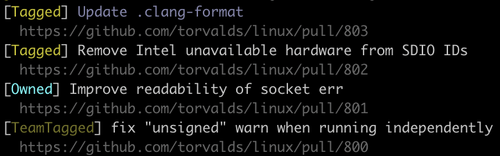

# github-notifications

Small script to view GitHub notifications in the terminal


Shows and color-codes the notification source, eg if you're the owner or were tagged.
Distinguishes between reviewer request as part of a team vs reviewer request as an individual.

## Build and usage
- [install Rust and Cargo](https://doc.rust-lang.org/cargo/getting-started/installation.html)
- if you don't already have one, generate a [GitHub Token](https://github.com/settings/tokens) with the `repo` permission
- set the `GITHUB_TOKEN` environment variable to this token
- run `cargo build --release` on the project to generate the executable
- move the `target/release/github-notifications` executable into a directory on your path, eg:

  ```sh
  mv target/release/github-notifications /usr/local/bin
  ```

- run `github-notifications`
